Repositório desenvolvido durante os estudos de **Java**, reunindo 19 exemplos práticos de criação de interfaces gráficas utilizando principalmente as bibliotecas **AWT** e **Swing**.

##Funcionalidades
Os exemplos apresentam uma evolução gradual dos conceitos, começando pela criação de uma janela (`Frame`) e avançando para componentes visuais, tratamento de eventos, operações matemáticas, menus, formulários, listas, caixas de seleção, botões de opção e pequenas aplicações interativas.

##Criação de interfaces gráficas em Java
* Java AWT
* Java Swing
* `Frame` e `JFrame`
* `Label` e `JLabel`
* `TextField` e `JTextField`
* `Button` e `JButton`
* `TextArea`
* `Panel` e `JPanel`
* `Dimension`
* `GridLayout`
* `MenuBar`, `Menu` e `MenuItem`
* `JPasswordField`
* `JColorChooser`
* `JList`
* `JCheckBox`
* `JRadioButton`
* `ButtonGroup`
* `JOptionPane`
* `ImageIcon`
* Tratamento de eventos
* `ActionListener`
* `ListSelectionListener`
* `ItemListener`
* Estruturas condicionais
* Operações matemáticas
* Conversão de tipos
* Geração de números aleatórios
* Manipulação de textos
* Interfaces para operações de CRUD

##Observação

Este projeto possui finalidade acadêmica e educacional, sendo utilizado para prática e consolidação dos conhecimentos adquiridos durante os estudos de Java.

## Telas dos Projetos realizados

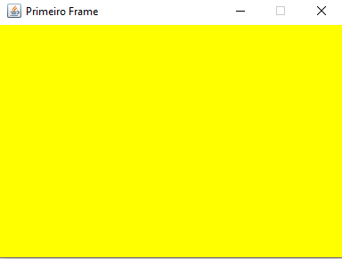

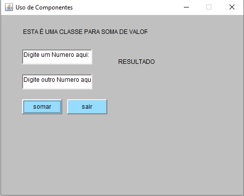

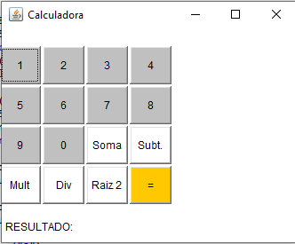

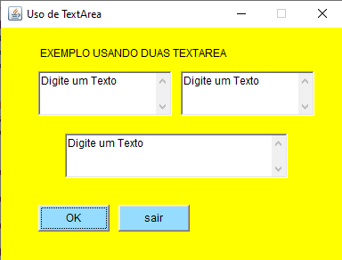

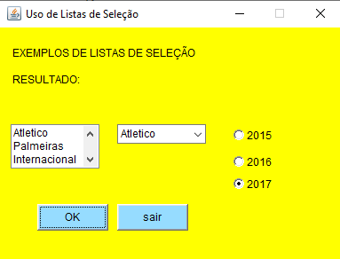

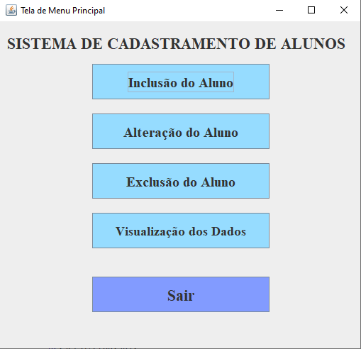

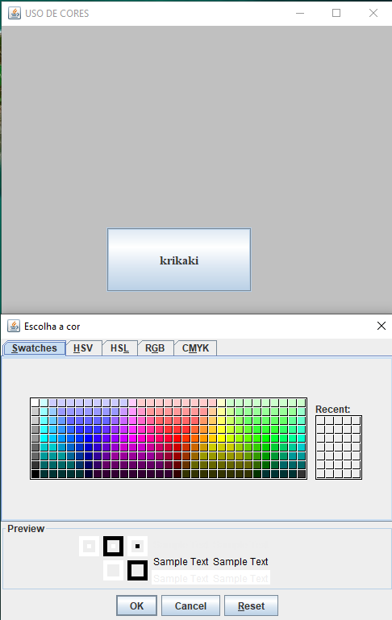

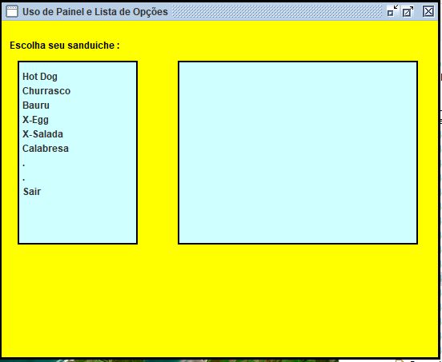

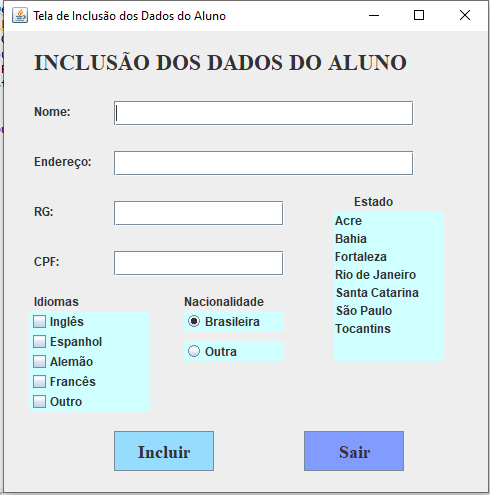

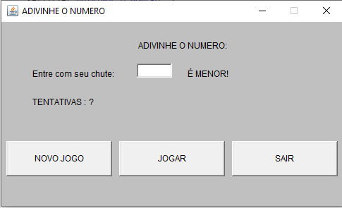

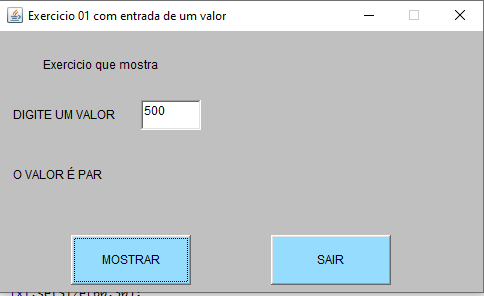

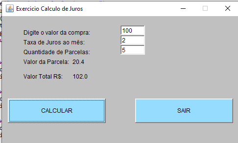
